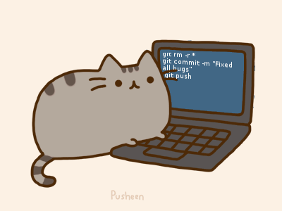

## About
- Postgraduate student studying Software Systems Engineering at University College London.
- Graduated with a first-class in Computer Science from Goldsmiths, University of London.
- Interested in backend software development, physical computing with Arduino, compiler design, and developing CLI tools.

## Tech Stack
💻 &nbsp;
  
  
  
    
🌐 &nbsp;
  
  
    
⚙️ &nbsp;
  
  
    
🔧 &nbsp;
  
  
    

## Stats

<!--- https://github.com/anuraghazra/github-readme-stats/blob/master/themes/README.md --->
